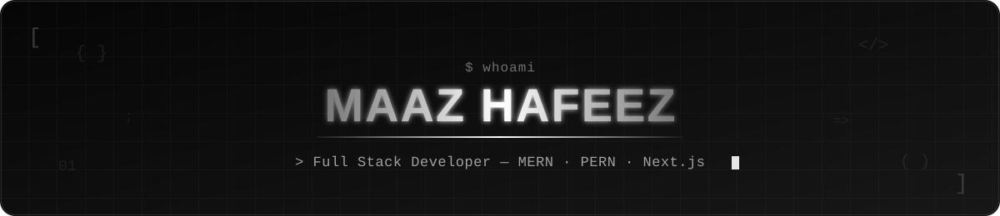

<!-- MAAZ HAFEEZ — GITHUB PROFILE README -->

<!-- Banner (base64 SVG, no external file needed) -->

<!-- /header -->

 

<!-- About -->

## About

I'm a Full Stack Developer with a good foundation across the modern web stack, including frontend, backend, databases, and deployment. I enjoy learning, building, and solving problems, always aiming to write simple, reliable, and maintainable software.

- Working on **Full Stack Development**
- Sharpening skills in **Backend Engineering** and **AI**
- Interested in **AI**, **Cloud**, and **System Design**
- Open for collaborations
- Blogs at [Hashnode](https://hashnode.com/@maazzz)
- Reach me at [maazhafeez698@gmail.com](mailto:maazhafeez698@gmail.com)

 

<!-- Stack -->

## Stack

 

Languages
 

  

Frontend
 

  

Backend
 

  

Database & ORM
 

  

Auth & Security
 

  

Tools & Deployment
 

  
<!-- Currently -->

## Currently

Building production-ready full-stack software, diving deeper into backend engineering and AI, and turning real-world ideas into reliable products.

 

<!-- Featured Projects (static table — dynamic repo-card widgets are unreliable) -->

## Featured

| Project                                                                                         | Description                                                                                                                                                                                           | Stack                                 |
| ----------------------------------------------------------------------------------------------- | ----------------------------------------------------------------------------------------------------------------------------------------------------------------------------------------------------- | ------------------------------------- |
| [**kafka-live-location-tracker**](https://github.com/maazhafeez698/kafka-live-location-tracker) | Authenticated real-time location sharing — Socket.IO for live delivery, Kafka as the event backbone with independent realtime & history consumers, MongoDB for persistence                            | Node.js · Kafka · Socket.IO · MongoDB |
| [**million-checkboxes**](https://github.com/maazhafeez698/million-checkboxes)                   | A shared canvas of 1,000,000 real-time checkboxes — Redis bitmaps for compact state, Pub/Sub fan-out, chunked loading, and client-side virtualization so the DOM never renders more than the viewport | Node.js · Redis · Socket.IO           |
| [**nova-clash**](https://github.com/maazhafeez698/nova-clash)                                   | Tic Tac Toe with Classic & Ultimate modes, a minimax AI opponent, and two-device multiplayer over WebRTC via a shareable invite code                                                                  | React · Tailwind CSS · Bun            |

 

<!-- Activity (komarev.com profile-view counter) -->

## Activity

  

  

Full contribution history: <a href="https://github.com/maazhafeez698">github.com/maazhafeez698</a>

 

<!-- Connect -->

## Connect

<!-- footer divider -->

